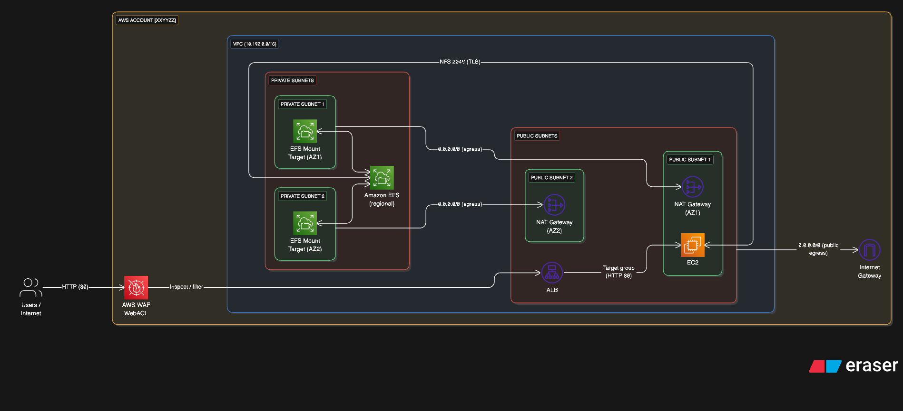

# aws-cloudformation-ec2-public-stack-deploy

## Introduction

With the growing preference for **low-code and no-code** solutions, many businesses want to automate infrastructure without deep DevOps expertise. **AWS CloudFormation** meets this need by being **natively integrated into AWS**, requiring no extra tooling, and offering a **declarative, template-driven approach** that feels more like configuration than coding. 

Compared to third-party tools like **Terraform**, CloudFormation is often **faster to adopt** and helps reduce both setup time and operational overhead. This makes it an attractive option for organizations prioritizing **speed, simplicity, and automation** without heavy engineering investment.  

This repository demonstrates the **power and flexibility of CloudFormation** by deploying a secure, highly available application stack on AWS.  

## Problem Statement 

Design and deploy, using **AWS CloudFormation**, a **highly available and secure application environment** on AWS. The solution should include:  

- A **highly available VPC architecture** spanning multiple Availability Zones.  
- Appropriate **networking components** (such as Internet/NAT gateways and routing) to enable both public access and controlled private connectivity.  
- An **EC2 instance** that is automatically bootstrapped to serve the [**2048 web game**](https://github.com/gabrielecirulli/2048), with persistent storage provided by **Amazon EFS**.  
- An **Application Load Balancer (ALB)** to distribute traffic across the application layer.  
- An **AWS WAF WebACL** in front of the ALB to protect against common web threats.  

The CloudFormation template should provision all resources and output the ALB’s public DNS name for accessing the application.  

## Solution

The CloudFormation templates provided provision a **secure, highly available web stack** on AWS that serves the **2048 web game** via an **Application Load Balancer (ALB)** protected by **AWS WAF**, with content persisted on **Amazon EFS**. Networking spans **two AZs** with **public/private subnets**, **IGW**, and **per-AZ NAT Gateways**.

Two flavours of the solution are provided to cover difference approaches to accessing the instances: 
1. Deploying ec2 instance using an already existing AWS key pair. See subfolder `existing-aws-key-pair`
2. Deploying ec2 instance and providing an existing public key. See subfolder `importing-existing-public-key`. 

### What it Deploys (by layer)

**Networking**
- **VPC** with CIDR `10.192.0.0/16`
- **Two public** and **two private** subnets across **two AZs**
- **Internet Gateway** + public route table (`0.0.0.0/0` → IGW)
- **Two NAT Gateways** (one per AZ) + private route tables (`0.0.0.0/0` → NAT in AZ)

**Compute & Storage**
- **EC2 instance** (Amazon Linux) in Public Subnet 1
- **UserData bootstrap**:
  - Installs **nginx** and downloads the **2048** game from GitHub
  - Installs **amazon-efs-utils**, **mounts EFS with TLS**, seeds `/mnt/efs/html`
  - **Bind-mounts** EFS content over `/usr/share/nginx/html` for persistence
- **Amazon EFS** file system with **mount targets in both private subnets (one per AZ)** providing **multi-AZ, highly available** NFS endpoints

**Traffic Management & Security**
- **ALB** (internet-facing) across both public subnets
- **Target group** forwarding HTTP (80) to the instance
- **AWS WAFv2 WebACL** (AWSManagedRulesCommonRuleSet) **associated to the ALB**
- **Security Groups**:
  - **ALB SG**: ingress 80/443 from Internet, egress all
  - **EC2 SG**: SSH (22) from the Internet (tighten in prod), HTTP from ALB only
  - **EFS SG**: NFS (2049) from EC2 SG only

---

### How the Requirements Are Met
- **Highly available VPC**: multi-AZ subnets; ALB spans subnets for HA; per-AZ NAT Gateways.
- **Controlled connectivity**: IGW for public ingress/egress; NAT for private egress; explicit route tables.
- **Persistent app data**: EFS stores game assets; EC2 can be replaced without data loss.
- **Storage HA**: **EFS** exposes **two mount targets (one per AZ)** in this stack, so the application retains access even if an AZ is unavailable.
- **Secure front door**: ALB terminates public traffic; **WAF** filters common exploits.

---

### Deploy via AWS Console

Follow these steps to deploy the CloudFormation template using the AWS Management Console.

#### 1. Log in to AWS Console and Open CloudFormation
- Open [AWS Management Console](https://console.aws.amazon.com/).
- Make sure you are in the **correct region** (e.g., `eu-west-1`) where your AMI and resources should be created.
- In the AWS Console search bar, type **CloudFormation** and select it.
- Click **Stacks** in the left panel.

#### 2. Create Stack
- Click **Create stack** → **With new resources (standard)**.
- Under *Specify template*, choose **Upload a template file**.
- Click **Choose file**, select your local `template.yaml`, then click **Next**.
- Enter a **Stack name** (e.g., `ec2-demo-taseemba`).
- Fill in the **Parameters**:
  - **EnvironmentName** → e.g., `demo-ec2`
  - **KeyPairName** → Select an existing EC2 KeyPair in your region (for SSH access).
  - **VpcCIDR** → Default `10.192.0.0/16` is fine unless you need a custom range.
  - **Ec2Ami** → Provide an AMI ID (default in the template works in `eu-west-1`).
- Click **Next**.
- Review all settings.
- Scroll down to **Capabilities** and check:
  - ✅ *I acknowledge that AWS CloudFormation might create IAM resources with custom names*.
- Click **Create stack**.

#### 3. Monitor Deployment
- You’ll be redirected to the **Stack Details** page.
- In the **Events** tab, watch resources being created (VPC, Subnets, NAT, EC2, ALB, WAF, etc.).
- Wait until the stack status changes to **`CREATE_COMPLETE`**.

#### 4. Get the ALB DNS Name
- Go to the **Outputs** tab of your stack.
- Copy the value of **LoadBalancerDNSName**.
- Open a browser and go to:

